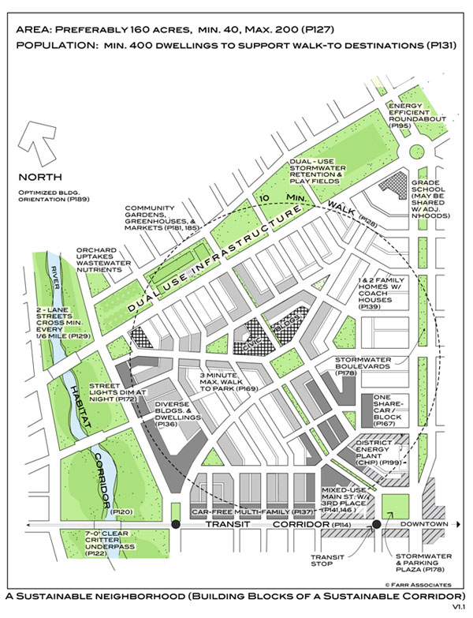
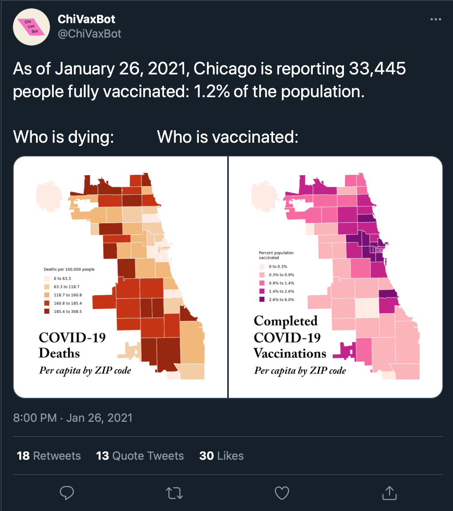
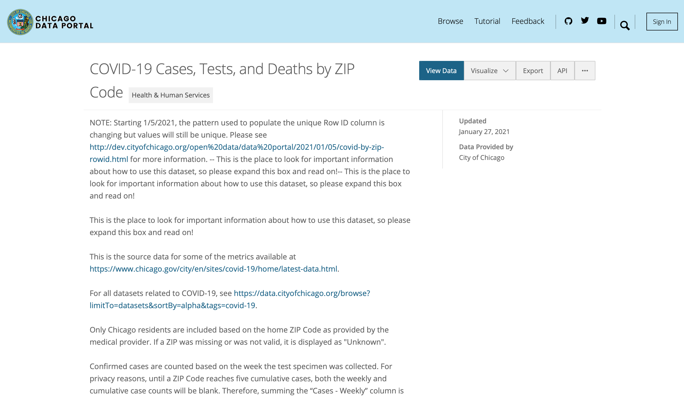
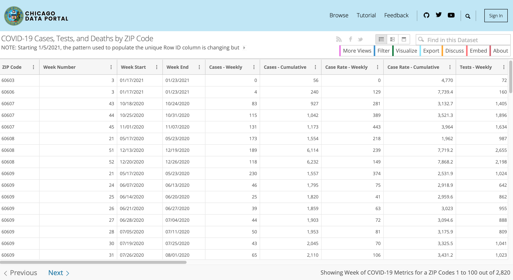

```{r setup, include=FALSE}
options(htmltools.dir.version = FALSE)
library(pacman)
p_load(knitr, fontawesome, countdown, xaringanExtra)
knitr::opts_chunk$set(warning = FALSE, message = FALSE)
#devtools::install_github("gadenbuie/xaringanExtra")
#devtools::install_github("rstudio/fontawesome")
#devtools::install_github("gadenbuie/countdown")
xaringanExtra::use_panelset()
xaringanExtra::use_share_again()
xaringanExtra::style_share_again(
  share_buttons = c("twitter", "linkedin", "pocket")
)
```
name: What is a neighborhood?
class: left, bottom, inverse
background-image: url(images/02_1_anastasia-dulgier-OKOOGO578eo-unsplash.jpg)
background-size: cover

# Neighborhood Analysis
.font-35[Session 2: What is a Neighborhood?]

???
Today, we're going to spend more time getting to know one another, digging into some of our assumptions about what neighborhoods are, and exploring a bit of our judgements regarding what makes a neighborhood good or bad.

Let's start by introducing ourselves...
---
name: Your Turn
class: right, middle
background-image: url(images/bruno-aguirre-sHP3l9iMM30-unsplash-2.jpg)
background-size: cover

# Its your turn to share...
---
name: Your Turn 2
class: right, middle
background-image: url(images/bruno-aguirre-sHP3l9iMM30-unsplash-2.jpg)
background-size: cover
#<br>

# Who are you?
# Where is home? 
# What do you do here?
# What types of stories <br>do you hope to tell?

---
name: Last Class Whats a Neighborhood
class: top, left

.pull-left[
```{r NeighUnit, echo=FALSE, out.width="100%"}

```
]

.font-35[.pull-right[
In our last session, you articulated qualities of neighborhoods...
- A space to live in and interact
- Sense of place
- Distinct boundaries
- Overlap of neighborhood and community
- Overlapping dimensions
- Living organism - complex adaptive system
- Functional unit for value capture
]
]
---
name: Question 1 - Good or Bad
class: top, right
background-image: url(images/02_5_pawel-czerwinski-T1ZIQDUjwiY-unsplash.jpg)
background-size: cover

# What makes a neighborhood <br>.salt[good] or .heat[bad]?

---

name: Question 2 - APA Places
class: top, right
background-image: url(images/meghan-schiereck-REgC5GZEXU4-unsplash.jpg)
background-size: cover

# Are APA Great Places <br>.heat[biased?]
---
name: Question 4 - Gentrification
class: top, inverse
background-image: url(images/02_2_fernando-hernandez-zQzaErgqAmY-unsplash.jpg)
background-size: cover

# .fat[Gentrification] <br> What is it?
--

# How should <br>we measure it?

--

# Let's explore a <br>bit more...
---
name: pause for covid
class: top, left

# A Tweet sparks a question...
.pull-left[
```{r CDPH_Tweet, echo=FALSE, out.width="83%"}

```
]

.pull-right[
.font-35[
Sorry to bring COVID into this...

What demographic factors help to explain the difference between where people are dying and where vaccinations are occurring?
]
]
---
name: Get Data
class: top, left

```{r chi_portal, echo=FALSE, out.width="100%"}
include_graphics("images/chi_portal_covid.png")
```
---
name: Get Data 2
class: top, left

```{r chi_portal2, echo=FALSE, out.width="100%"}

```
---
name: Get Data 3
class: top, left

```{r chi_portal3, echo=FALSE, out.width="100%"}

```
---
name: Scatterplot COVID Infection Rate
class: top, left
```{r work_stuff, echo=FALSE}
p_load("ggplot2", "RSocrata", "sf", "tidyverse", "tigris")

if (file.exists("data/chi_ph.rds")){dataset<-readRDS("data/chi_ph.rds")}
if (!file.exists("data/chi_ph.rds")){
  cdph<-RSocrata::read.socrata("https://data.cityofchicago.org/resource/yhhz-zm2v.json")
cdph_vacc<-RSocrata::read.socrata("https://data.cityofchicago.org/resource/553k-3xzc.json")

cdph_chart<-cdph %>% 
  filter(week_number == 3) %>% 
  select(zip_code, percent_tested_positive_cumulative, death_rate_cumulative) %>% mutate(percent_tested_positive_cumulative = as.numeric(percent_tested_positive_cumulative), death_rate_cumulative = as.numeric(death_rate_cumulative))

vacc_chart<-cdph_vacc %>% 
  filter(date == "2021-01-25") %>% 
  select(zip_code, X_1st_dose_percent_population) %>% mutate(X_1st_dose_percent_population = as.numeric(X_1st_dose_percent_population))
dataset<-left_join(cdph_chart, vacc_chart, by="zip_code")

dir.create("data")
saveRDS(dataset, "data/chi_ph.rds")
rm(cdph, cdph_vacc)
}

```

.font-35[What's the relationship between COVID *cases* and vaccinations?]
.pull-left[

.panelset[
   .panel[.panel-name[Output]
   ```{r scatterplot, echo=FALSE}
ggplot(dataset %>% filter(percent_tested_positive_cumulative !=0)) +
  geom_point(aes(x=percent_tested_positive_cumulative, y=X_1st_dose_percent_population))+
  labs(x="Pop. Positive (%)", y="Pop. Vaccinated (%)")+
  scale_x_continuous(labels=scales::percent)+
  scale_y_continuous(labels=scales::percent)+
  theme_minimal()
```
   ]
   .panel[.panel-name[Code]
```{r scatterplot_code, eval=FALSE}
ggplot(dataset %>% filter(percent_tested_positive_cumulative !=0)) +
  geom_point(aes(x=percent_tested_positive_cumulative, y=X_1st_dose_percent_population))+
  labs(x="Pop. Positive (%)", y="Pop. Vaccinated (%)")+
  scale_x_continuous(labels=scales::percent)+
  scale_y_continuous(labels=scales::percent)+
  theme_minimal()
```
   ]
]
]
.pull-right[
How would you describe this in your own words?

- What does each point represent?

- Are the scales for X and Y reasonable? What do they tell you?

- Is there a particular region on this plot that might spark questions for further exploration?

- Are you ready to write an op-ed for the Chicago Tribune or Sun Times (the two major newspapers)?
]
---
name: Scatterplot death rate
class: top, left

.font-35[What's the relationship between COVID *deaths* and vaccinations?]
.pull-left[
.panelset[
.panel[.panel-name[Output]
```{r scatterplot_death, echo=FALSE}
ggplot(dataset %>% filter(death_rate_cumulative !=0)) +
  geom_point(aes(x=death_rate_cumulative, y=X_1st_dose_percent_population))+
  labs(x="Death Rate (per 1,000)", y="Pop. Vaccinated (%)")+
  scale_x_continuous(labels=scales::percent)+
  scale_y_continuous(labels=scales::percent)+
  theme_minimal()
```
]

.panel[.panel-name[Code]
```{r scatterplot_death_output, eval=FALSE}
ggplot(dataset %>% filter(percent_tested_positive_cumulative !=0)) +
  geom_point(aes(x=death_rate_cumulative, y=X_1st_dose_percent_population))+
  labs(x="Death Rate (per 1,000)", y="Pop. Vaccinated (%)")+
  scale_x_continuous(labels=scales::percent)+
  scale_y_continuous(labels=scales::percent)+
  theme_minimal()
```
]

]
]
.pull-right[
How would you describe this in your own words?

- What does each point represent?

- Are the scales for X and Y reasonable? What do they tell you?

- Is there a particular region on this plot that might spark questions for further exploration?

- Are you ready to write an op-ed for the Chicago Tribune or Sun Times (the two major newspapers)?
]
---
name: Maps
class: top, left

```{r map_it, echo=FALSE}
if(file.exists("data/zips.rds")){
  zips<-readRDS("data/zips.rds")
  zips<-st_as_sf(zips)
}

if(!file.exists("data/zips.rds")){
  zips<-tigris::zctas(state="IL", class="sf") %>% 
    filter(substr(GEOID10, 0, 3) %in% c("606", "608"))
  saveRDS(zips, "data/zips.rds")
}

if(file.exists("data/chi.rds")){
  chi<-readRDS("data/chi.rds")
  chi<-st_as_sf(zips)
}

if(!file.exists("data/chi.rds")){
chi<-tigris::places(state="IL", class="sf") %>% filter(NAME == "Chicago")
saveRDS(chi, "data/chi.rds")
}

dataset<-left_join(dataset, zips, by=c("zip_code" = "GEOID10")) %>% st_as_sf()
```
.pull-left[
.panelset[
.panel[.panel-name[Output]
```{r map_tested, echo=FALSE}
ggplot() +
  geom_sf(data=dataset, aes(fill=percent_tested_positive_cumulative))+
  scale_fill_continuous(trans = 'reverse')+
  geom_sf(data=chi, colour="gray40", fill=NA)+
  labs(fill="Pop. Positive (%)")+
  theme_minimal()
```
]
.panel[.panel-name[Code]
```{r map_tested_code, eval=FALSE}
ggplot() +
  geom_sf(data=dataset, aes(fill=percent_tested_positive_cumulative))+
  scale_fill_continuous(trans = 'reverse')+
  geom_sf(data=chi, colour="gray40", fill=NA)+
  labs(fill="Pop. Positive (%)")+
  theme_minimal()
```
]
]]

.pull-right[
.panelset[
.panel[.panel-name[Output]
```{r map_vaccinated, echo=FALSE}
ggplot() +
  geom_sf(data=dataset, aes(fill=X_1st_dose_percent_population))+
  scale_fill_continuous(trans = 'reverse')+
  geom_sf(data=chi, colour="gray40", fill=NA)+
  labs(fill="Pop. Vaccinated (%)")+
  theme_minimal()
```
]
.panel[.panel-name[Code]
```{r map_vaccinated_code, eval=FALSE}
ggplot() +
  geom_sf(data=dataset, aes(fill=X_1st_dose_percent_population))+
  scale_fill_continuous(trans = 'reverse')+
  geom_sf(data=chi, colour="gray40", fill=NA)+
  labs(fill="Pop. Vaccinated (%)")+
  theme_minimal()
```
]
]

]

---
name: Maps2
class: top, left

.pull-left[
.panelset[
.panel[.panel-name[Output]
```{r map_died, echo=FALSE}
ggplot() +
  geom_sf(data=dataset, aes(fill=death_rate_cumulative))+
  scale_fill_continuous(trans = 'reverse')+
  geom_sf(data=chi, colour="gray40", fill=NA)+
  labs(fill="Pop. Died (%)")+
  theme_minimal()
```
]
.panel[.panel-name[Code]
```{r map_died_code, eval=FALSE}
ggplot() +
  geom_sf(data=dataset, aes(fill=death_rate_cumulative))+
  scale_fill_continuous(trans = 'reverse')+
  geom_sf(data=chi, colour="gray40", fill=NA)+
  labs(fill="Pop. Died (%)")+
  theme_minimal()
```
]
]]

.pull-right[
.panelset[
.panel[.panel-name[Output]
```{r map_vaccinated2, echo=FALSE}
ggplot() +
  geom_sf(data=dataset, aes(fill=X_1st_dose_percent_population))+
  scale_fill_continuous(trans = 'reverse')+
  geom_sf(data=chi, colour="gray40", fill=NA)+
  labs(fill="Pop. Vaccinated (%)")+
  theme_minimal()
```
]
.panel[.panel-name[Code]
```{r map_vaccinated_code2, eval=FALSE}
ggplot() +
  geom_sf(data=dataset, aes(fill=X_1st_dose_percent_population))+
  scale_fill_continuous(trans = 'reverse')+
  geom_sf(data=chi, colour="gray40", fill=NA)+
  labs(fill="Pop. Vaccinated (%)")+
  theme_minimal()
```
]
]

]
---
name: What Next?
class: bottom, left
background-image: url(images/kelly-sikkema-cXkrqY2wFyc-unsplash.jpg)
background-size: cover

### .salt[What Next?]
.font-35[
What are the types of things you would want to <br>explore to understand what's going on here?

Where might the information come from?
]

---
name: Next Class
class: top, left, inverse
background-image: url(images/03_23_david-werbrouck-5GwLlb-_UYk-unsplash.jpg)
background-size: cover

# Tuesday's Class
.footnote[.font-35[On Tuesday, we'll start exploring the R programming language and RStudio Integrated Development Environment]]