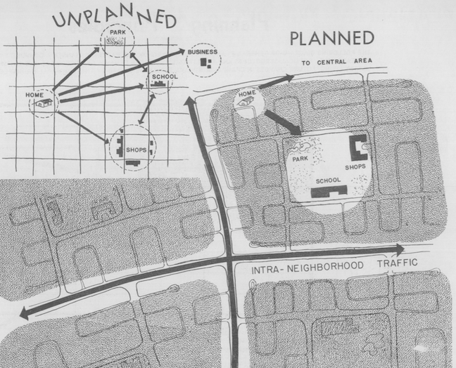
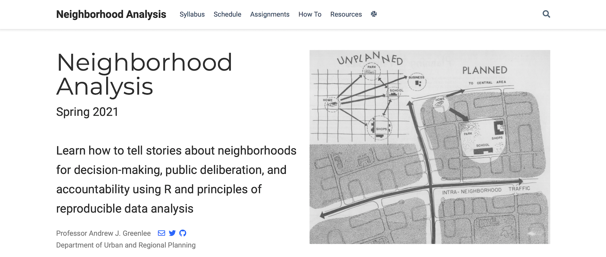

```{r setup, include=FALSE}
options(htmltools.dir.version = FALSE)
library(knitr)
#devtools::install_github("rstudio/fontawesome")
#devtools::install_github("gadenbuie/countdown")
library(pacman)
p_load(knitr, fontawesome, countdown, xaringanExtra)
knitr::opts_chunk$set(warning = FALSE, message = FALSE)
xaringanExtra::use_share_again()
xaringanExtra::style_share_again(
  share_buttons = c("twitter", "linkedin", "pocket")
)
```
name: xaringan-title
class: left, bottom, inverse
background-image: url(images/1_rikki-chan-9FfJW5Tu_qk-unsplash.jpg)
background-size: cover

# Neighborhood Analysis
.font-35[Session 1: Course Introduction]
---
name: What is a neighborhood?
class: middle, inverse

# What is a <br> .salt[.fancy[neighborhood?]]

`r countdown(minutes = 2, seconds=0, color_text = "white", top=0, font_size="4em")`
---
name: Answer 1
class: right, middle, inverse
background-image: url(images/3_george-kedenburg-iii-KO3KbZ0v_g4-unsplash.jpg)
background-size: cover

# There's less consensus about <br> .fat[how to define]<br> neighborhoods than you might think

---
name: Champaign Comprehensive Plan 1950
background-image: url(images/cc_comp-1950.png)
background-size: contain
---
name: Champaign Comprehensive Plan 1950 Inset
background-image: url(images/cc_comp-1950-inset.png)
background-size: contain
---
name: Champaign Comprehensive Plan 1950 Inset2
background-image: url(images/cc-comp_neigh.png)
background-size: contain
---
name: Champaign Comprehensive Plan 1950 Inset2
background-image: url(images/cc_comp_neigh2.png)
background-size: contain
---
name: Info 1
class: left, middle
background-size: cover

.pull-left[
.font-35[Neighborhoods help describe <br>.fat[human scale] <br>units for living 
]]

.pull-right[

]
---
name: Overview
class: top, inverse
background-image: url(images/8_dynamicwang-g-YsyUUwT9M-unsplash.jpg)
background-size: cover


# Course Overview and Objectives

.font-35[
- Together, we will learn techniques for analyzing the demographic, economic, physical, and social conditions that exist at the neighborhood scale
- We will focus on the craft of translating multiple sources of information into stories that can be used to inform decisionmaking
- We will focus on telling stories about the past, present, and future of neighborhoods
- We will learn to work with many types of information, including census data and administrative data
]

---
name: Overview
class: top, inverse
background-image: url(images/8_dynamicwang-g-YsyUUwT9M-unsplash.jpg)
background-size: cover

# By the end of this course, we will...

.font-35[
1.	Become familiar with common sources of information used to describe neighborhoods and neighborhood characteristics;

2.	Learn how to use R, RStudio, and GitHub to create reproducible analysis of neighborhood-level information;

3.	Learn how to use the information to tell compelling stories for deliberation and decision-making.
]

---
name: Question 3
class: middle, inverse

# What makes for .salt[effective] analysis?

.font-35[(Thinking about neighborhoods, of course...)]

`r countdown(minutes = 2, seconds=0, color_text = "white", top=0, font_size="4em")`
---
name: Expectations
class: top

# Course Format and Expectations

Let's look at the [course website](https://neighborhood-analysis-s21.netlify.app)


---
name: Questions
class: top, inverse
background-image: url(images/13_ray-fragapane-QM5-lbqzREc-unsplash.jpg)
background-size: cover

# Questions?
---
name: Getting Set Up
class: top, inverse
background-image: url(images/13_ray-fragapane-QM5-lbqzREc-unsplash.jpg)
background-size: cover

# Getting Set Up

.font-35[
- Complete the course introductory survey
- Download and install R and RSudio
- Create a GitHub Account
- Download and install GitHub Desktop Client
- Familiarize yourself with the course website
]

---
name: Question 4
background-image: url(images/dark-texture.jpg)
background-size: cover
class: top, left, inverse

# Who are you?
.font-35[
<br>
Where is home?<br>
<br>
What do you do here? (Degree, Major, Interests)<br>
<br>
What was significant about a neighborhood you've lived in?<br>
<br>
What do you hope to gain from our class?
]
---
name: Next Class
class: top, left, inverse
background-image: url(images/14_javier-garcia-jJbQBP_yh68-unsplash.jpg)
background-size: cover

# Thursday's Class
.pull-left[
- On Thursday, we'll start exploring the qualities which make some neighborhoods more successful
- Please reflect upon the following:
  + What is a neighborhood? How should neighborhoods be defined? Why might neighborhoods be important units of analysis for city planners and urbanists?
  + What characteristics make a place great?
  ]
---
class: right, top
background-image: url(images/1_1_ross-elder-uXQVNkam3hE-unsplash.jpg)
background-size: cover


# Find me at...

[`r fa(name = "twitter-square")` @urbprof](http://twitter.com/urbprof)  
[`r fa(name = "github-square")` @agreen4](http://github.com/agreen4)  
[`r fa(name = "envelope-open-text")` agreen4@illinois.edu](mailto:agreen4@illinois.edu)

```{r pdf, include=FALSE}
#install.packages("webshot")
library(webshot)
webshot("Session-1.html", "Session-1.pdf")
```