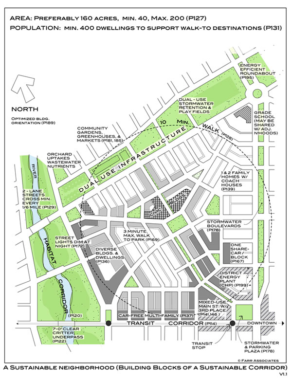
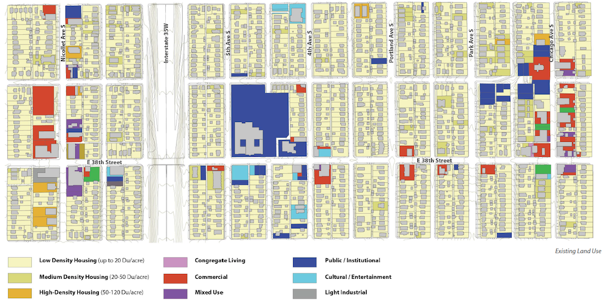

```{r setup, include=FALSE}
options(htmltools.dir.version = FALSE)
library(knitr)
#devtools::install_github("rstudio/fontawesome")
#devtools::install_github("gadenbuie/countdown")
library(pacman)
p_load(knitr, fontawesome, countdown, xaringanExtra)
knitr::opts_chunk$set(warning = FALSE, message = FALSE)
xaringanExtra::use_share_again()
xaringanExtra::style_share_again(
  share_buttons = c("twitter", "linkedin", "pocket")
)
```
name: xaringan-title
class: left, bottom, inverse
background-image: url(images/1_rikki-chan-9FfJW5Tu_qk-unsplash.jpg)
background-size: cover

# Neighborhood Analysis
## Session 1: Course Introduction
---
name: What is a neighborhood?
class: middle, inverse

# What is a <br> .salt[.fancy[neighborhood?]]

`r countdown(minutes = 2, seconds=0, color_text = "white", top=0, font_size="4em")`
---
name: Answer 1
class: right, middle, inverse
background-image: url(images/3_george-kedenburg-iii-KO3KbZ0v_g4-unsplash.jpg)
background-size: cover

# There's less consensus about <br> .fat[how to define]<br> neighborhoods than you might think

.footnote[
We'll be talking more about this on Thursday
]
---
name: Overview
class: top, inverse
background-image: url(images/8_dynamicwang-g-YsyUUwT9M-unsplash.jpg)
background-size: cover

# Course Overview and Objectives

### - Together, we will learn techniques for analyzing the demographic, economic, physical, and social conditions that exist at the neighborhood scale
### - We will focus on the craft of translating multiple sources of information into stories that can be used to inform decision-making
### - We will focus on telling stories about the past, present, and future of neighborhoods
### - We will learn to work with many types of information, including census data, administrative data, and will collect some primary data
---
name: Overview
class: top, inverse
background-image: url(images/8_dynamicwang-g-YsyUUwT9M-unsplash.jpg)
background-size: cover

# By the end of this course, we will...

### 1.	Become familiar with common sources of information used to describe neighborhoods and neighborhood characteristics;
### 2.	Learn how to use R and RStudio in service of analyzing neighborhood-level information;
### 3.	Learn how to use the information to tell compelling stories for deliberation and decision-making.
---
name: Learning R
class: top

# Learning R for Urban Planning

Wy would we want to make use of R as a tool for urban planning and analysis?

- R is **open source** and available at no cost
- R code is **scalable and reproducible** making it easy for others to reproduce our analysis given the same set of input data
- R is supported by a **diverse user community** that developes specialized applications for the R language
- R **connects** planning analysis to other forms of statistical analysis and data science

--
# Additional Rationales

- R forces us to learn the *nature* and *structure* of our data - this makes us **better consumers** of information
- R can help us to **integrate analyses** and streamline workflows, resulting in more efficient and effective work patterns

---
name: What should we know about neighborhood conditions?
class: middle, inverse

# What should we know about<br> .fat[.fancy[neighborhood conditions?]]

`r countdown(minutes = 2, seconds=0, color_text = "white", top=0, font_size="4em")`
---
name: Course Premise - Explore

.pull-left[

# Together we will...
.heat[Explore] <br>
Examine <br>
Describe <br>
Share <br>
]
.pull-rightn[

]
---
name: Course Premise - Examine

.pull-left[

# Together we will...
Explore <br>
.heat[Examine] <br>
Describe <br>
Share <br>
]

.pull-right[

]
---
name: Course Premise - Describe

.pull-left[
# Together we will...
Explore <br>
Examine <br>
.heat[Describe] <br>
Share <br>
]

.pull-right[

]
---
name: Course Premise - Share

.pull-left[

# Together we will...
Explore <br>
Examine <br>
Describe <br>
.heat[Share] <br>
]

.pull-right[

]
---

name: Expectations
class: top, inverse
background-image: url(images/8_dynamicwang-g-YsyUUwT9M-unsplash.jpg)
background-size: cover

# Course Format and Expectations

.pull-left[
## Format

- Class Sessions
- Reading and Reflection
- Assignments
- Engagement and Field Work
]

---
name: Expectations
class: top, inverse
background-image: url(images/8_dynamicwang-g-YsyUUwT9M-unsplash.jpg)
background-size: cover

# Course Format and Expectations

.pull-left[
## Format

- Class Sessions
- Reading and Reflection
- Assignments
- Engagement and Field Work
]

.pull-right[
## Expectations

- Engage
- Apply Yourself
- Accept Responsibility for what you Produce
]
---

name: Assignments
class: top

# Assignments

.pull-left[
.fat[Class Reflections] <br>
Grading Contract<br>
R Learner's Permit <br>
Polished Lab Notebooks <br>
Final Project<br>
Final Presentation <br>
]

.pull_right[

You will write short reflections on a weekly basis based upon prompts which will be shared in your weekly dossier.

This week's prompt: 

- What is a neighborhood? How should neighborhoods be defined?
- Why might neighborhoods be important units of analysis for city planners and more generally for urbanists?
- What characteristics make a place great?
]
---
name: Assignments
class: top

# Assignments

.pull-left[
Class Reflections<br>
.fat[Grading Contract]<br>
R Learner's Permit <br>
Polished Lab Notebooks <br>
Final Project<br>
Final Presentation <br>
]

.pull_right[
During the first two weeks of the class, you will develop your grading contact, which outlines the grade you are contracting for in the class as well as the agreed upon expectations for attaining that grade.
]
---
name: Assignments
class: top

# Assignments

.pull-left[
Class Reflections<br>
Grading Contract<br>
.fat[R Learner's Permit] <br>
Polished Lab Notebooks <br>
Final Project<br>
Final Presentation <br>
]

.pull_right[
During the first few weeks of class, you will be learning the basic elements of data manipulation and analysis using R and RStudio. You will take a short test to demonstrate  your mastery of core concepts of data manipulation using R and RStudio which we will build on throughout the remainder of the semester.
]
---
name: Assignments
class: top

# Assignments

.pull-left[
Class Reflections<br>
Grading Contract<br>
R Learner's Permit <br>
.fat[Polished Lab Notebooks] <br>
Final Project<br>
Final Presentation <br>
]

.pull_right[
Over the course of the semester, you will work on a series of lab notebooks which ask you to apply what you’ve learned in class to new data and analysis questions. These lab notebooks will guide you through learning new approaches to manipulating data. At the end of each notebook, there’s information on how you might extend your analysis beyond the lab.
]
---
name: Assignments
class: top

# Assignments

.pull-left[
Class Reflections<br>
Grading Contract<br>
R Learner's Permit <br>
Polished Lab Notebooks <br>
.fat[Final Project]<br>
Final Presentation <br>
]

.pull_right[
You will independently apply the skills and principles of data analysis we learn to produce a policy-relevant analysis. Your term assignment will have several deliverables which are spread throughout the semester:

- Project Proposal
- Project Background
- Final Project
]
---
name: Assignments
class: top

# Assignments

.pull-left[
Class Reflections<br>
Grading Contract<br>
R Learner's Permit <br>
Polished Lab Notebooks <br>
Final Project<br>
.fat[Final Presentation] <br>
]

.pull_right[
Graduate students are required to include a 10-minute presentation on their final project which will be given during one of our final course sessions as part of their grading contract. Undergraduate students are not required to complete a final project presentation, but may contract to do so for a higher grade (see more information on our approach to grades this semester below).
]
---

name: Attendance and Participation
class: top

# Attendance and Participation
.pull-left[

- Full participation is expected for all course sessions - that means that you should have completed readings assigned for each session, and briefed yourself on in-class workbooks prior to our class time
- To facilitate community and mutual learning, we'll engage with our cameras on during discussions (please talk with me if there are reasons you cannot meet this expectation)
- Excused absences *may* be granted on a case-by-case basis, but must be approved prior to the absence
]
.pull-right[

]
---
name: Honor Code
class: top

.pull-left[
# Honor Code
The Illinois Student Code states: “It is the responsibility of the student to refrain from infractions of academic integrity, from conduct that may lead to suspicion of such infractions, and from conduct that aids others in such infractions.” Note that you are subject to the Honor Code, as well as procedures for addressing violations to the Code, regardless of whether you have read it and understand it. According to the Code, “ignorance is no excuse.”

- In written work, all ideas (as well as data or other information) that are not your own must be cited. Note that ideas that require citation may not have been published or written down anywhere.
- While you are free—and indeed encouraged—to discuss assignments with your peers, all of your analysis, and writing should be your own. 
- The consequence for violating these expectations may include receiving no credit for the assignment in question, and at the discretion of the instructor, may include automatic failure of the course.
]

.pull-right[

]
---
name: Questions
class: center, middle, inverse
background-image: url(images/13_ray-fragapane-QM5-lbqzREc-unsplash.jpg)
background-size: cover

# Any Questions?
---
name: Question 3
class: middle, inverse

# What makes for .salt[effective] analysis?
## Thinking about neighborhoods, of course...
`r countdown(minutes = 2, seconds=0, color_text = "white", top=0, font_size="4em")`
---
name: Question 4
class: top, right, inverse

# Who are you?
## Where is home? 
## What do you do here? (Degree, Major, Interests)
## What was significant about a neighborhood you've lived in?
## What do you hope to gain from our class?

---
name: Dossier Review
class: top

# Week 1 Dossier Review

- Reflection Prompt
  + What is a neighborhood? How should neighborhoods be defined? Why might neighborhoods be important units of analysis for city planners and urbanists?
  + What characteristics make a place great?
- Deliverables
  + Take the course introductory survey
  + Introduction to R for Planners Workshop (1/30, 2/6)
- Get important dates on your calendars
- Download and install R and RStudio
- Set up a GitHub account
- Purchase *Data Visualization: A Practical Introduction*

---
name: Next Class
class: top, left, inverse
background-image: url(images/14_javier-garcia-jJbQBP_yh68-unsplash.jpg)
background-size: cover

# Thursday's Class
.pull-left[
- On Thursday, we'll start exploring the qualities which make some neighborhoods more successful
- Please reflect upon the following:
  + What is a neighborhood? How should neighborhoods be defined? Why might neighborhoods be important units of analysis for city planners and urbanists?
  + What characteristics make a place great?
  ]
---
class: right, top
background-image: url(images/1_1_ross-elder-uXQVNkam3hE-unsplash.jpg)
background-size: cover


# Find me at...

[`r fa(name = "twitter-square")` @urbprof](http://twitter.com/urbprof)  
[`r fa(name = "github-square")` @agreen4](http://github.com/agreen4)  
[`r fa(name = "envelope-open-text")` agreen4@illinois.edu](mailto:agreen4@illinois.edu)

```{r pdf, include=FALSE}
#install.packages("webshot")
library(webshot)
webshot("Session-1.html", "Session-1.pdf")
```