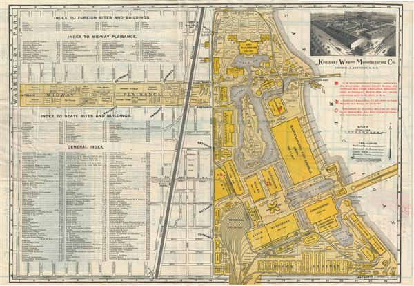
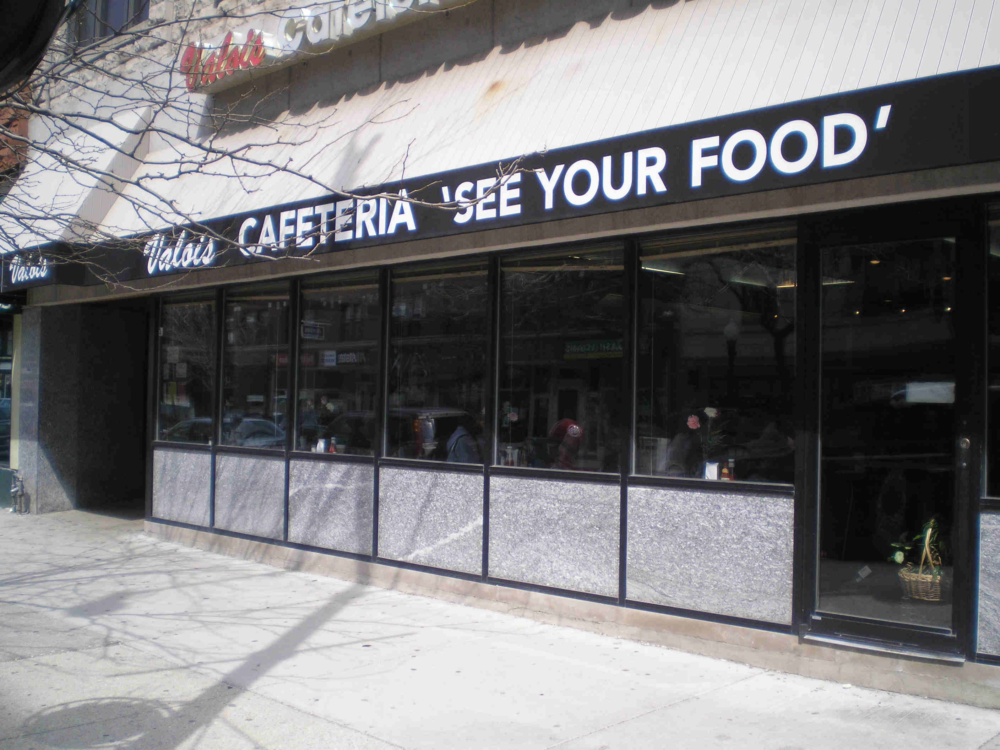
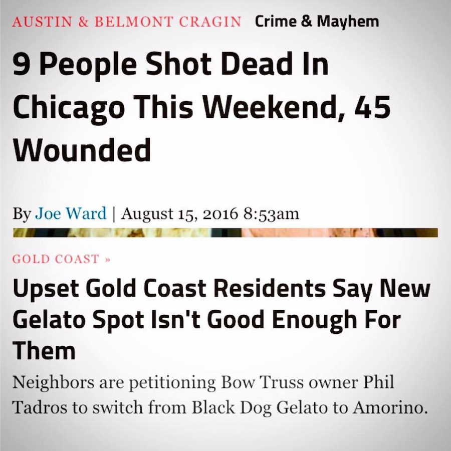
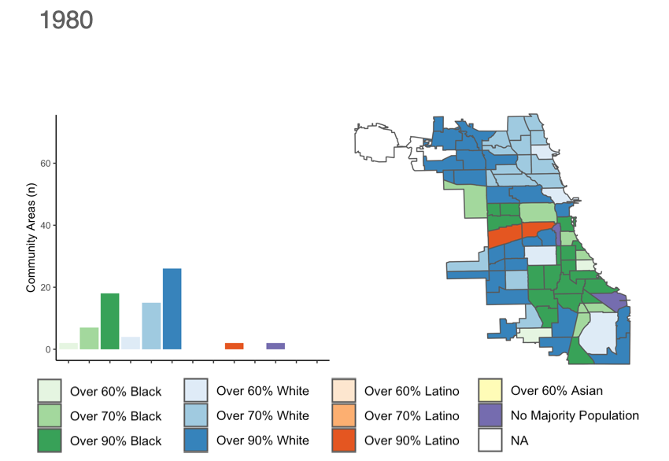

```{r setup, include=FALSE}
options(htmltools.dir.version = FALSE)
library(knitr)
#devtools::install_github("rstudio/fontawesome")
#devtools::install_github("gadenbuie/countdown")
library(pacman)
p_load(knitr, fontawesome, countdown, xaringanExtra)
knitr::opts_chunk$set(warning = FALSE, message = FALSE)
xaringanExtra::use_share_again()
xaringanExtra::style_share_again(
  share_buttons = c("twitter", "linkedin", "pocket")
)
```
name: xaringan-title
class: left, bottom, inverse
background-image: url(images/1_rikki-chan-9FfJW5Tu_qk-unsplash.jpg)
background-size: cover

# Neighborhood Analysis
.font-35[Session 1: Course Introduction]

???
Welcome to our first class... let's start with a simple question...
---
name: What is a neighborhood?
class: middle, inverse

# What is a <br> .salt[.fancy[neighborhood?]]

`r countdown(minutes = 2, seconds=0, color_text = "white", top=0, font_size="4em")`

???
Take two minutes to think about how you might define a neighborhood - don't worry, there's no right or wrong answers here - this is just to help us start developing some foundational definitions.
---
name: Answer 1
class: right, middle, inverse
background-image: url(images/3_george-kedenburg-iii-KO3KbZ0v_g4-unsplash.jpg)
background-size: cover

# There's less consensus about <br> .fat[how to define]<br> neighborhoods than you might think

???
We use neighborhoods to represent lots of different things - administrative geographies, personal and community identities, geographic units for plans...

Let's start by looking at a fairly normative view on what a neighborhood is...
---
name: Champaign Comprehensive Plan 1950
background-image: url(images/cc_comp-1950.png)
background-size: contain

???
This is an image from the 1950 comprehensive plan for Champaign, IL. This visual is designed to represent the qualities of a neighborhood unit. Looking at this what are some of the core functions of a neighborhood?

We can zoom in on the text description to learn more about some of the intended qualities for a neighborhood.
---
name: Champaign Comprehensive Plan 1950 Inset
background-image: url(images/cc_comp-1950-inset.png)
background-size: contain

???
- self contained
- scale
- local institutions
- civil society
- infrastructure
- accessible

The argument for neighborhood planning focuses on livability and economy
---
name: Champaign Comprehensive Plan 1950 Inset2
background-image: url(images/cc-comp_neigh.png)
background-size: contain

???
It's also important to note that neighborhoods scale in relationship to other neighborhoods - an important component of our work together is thinking about how neighborhoods fit with each other and how they compare to each other.
---
name: Champaign Comprehensive Plan 1950 Inset2
background-image: url(images/cc_comp_neigh2.png)
background-size: contain

???
This helps us to describe a coherent city through its complexity.
---
name: Human Scale
class: left, middle
background-size: cover

.pull-left[
.font-35[Neighborhoods help describe <br>.fat[human scale] <br>units for living 
]]

.pull-right[

]
---
name: Overview
class: top, inverse
background-image: url(images/8_dynamicwang-g-YsyUUwT9M-unsplash.jpg)
background-size: cover


# Course Overview and Objectives

.font-35[
- Together, we will learn techniques for analyzing the demographic, economic, physical, and social conditions that exist at the neighborhood scale
- We will focus on the craft of translating multiple sources of information into stories that can be used to inform decision making
- We will focus on telling stories about the past, present, and future of neighborhoods
- We will learn to work with and layer many types of information, including census data,  administrative data, and data extracted from the internet
]

---
name: Overview
class: top, inverse
background-image: url(images/8_dynamicwang-g-YsyUUwT9M-unsplash.jpg)
background-size: cover

# By the end of this course, we will...

.font-35[
1.	Become familiar with common sources of information used to describe neighborhoods and neighborhood characteristics;

2.	Learn how to use R, RStudio, and GitHub to create reproducible analysis of neighborhood-level information;

3.	Learn how to use the information to tell compelling stories for deliberation and decision-making.
]

---
name: Question 2
class: middle, inverse

# What makes for .salt[effective] analysis?

.font-35[Thinking about neighborhoods, of course...]

`r countdown(minutes = 2, seconds=0, color_text = "white", top=0, font_size="4em")`
---
name: Expectations
class: top

# Course Format and Expectations

Let's look at the [course website](https://neighborhood-analysis-s21.netlify.app)


---
name: Questions
class: top, inverse
background-image: url(images/13_ray-fragapane-QM5-lbqzREc-unsplash.jpg)
background-size: cover

# Questions?
---
name: Getting Set Up
class: top, inverse

# Getting Set Up

.font-35[
- Complete the course introductory survey
- Familiarize yourself with the course website
- Download and install R and RStudio
- Create a GitHub Account and install Github Desktop Client
]

---
name: Question 3
background-image: url(images/dark-texture.jpg)
background-size: cover
class: top, left, inverse

# Who are you?

.font-35[
- Where is home?
- What do you do here? (Degree, Major, Interests)
- What was significant about a neighborhood you've lived in?<br>
- What do you hope to gain from our class?
]
---
name: My turn to share
class: right, top
background-image: url(images/1_1_ross-elder-uXQVNkam3hE-unsplash.jpg)
background-size: cover


# My turn to share
---
name: My turn to share
class: right, top, inverse
background-image: url(images/02_6_neal-kharawala-XXA8PTuLD1Y-unsplash.jpg)
background-size: cover

# I Grew Up Here
---
name: My turn to share
class: left, top
background-image: url(images/02_7_map-chicago-panoramic-view-centered-on-hyde-park-projection-called-this-is-our-neighborhood-lauren-nassef.jpg)
background-size: auto
background-position: bottom

# More Specifically Here
.font-35[Hyde Park - Kenwood]
---
name: My turn to share
class: left, top

# Hyde Park - Kenwood

.pull-left[

]
---
name: My turn to share
class: left, top

# Hyde Park - Kenwood

.pull-left[

]
.pull-right[

]
---
name: My turn to share
class: left, top

# Hyde Park - Kenwood

.pull-left[

]
.pull-right[

]
---
name: My turn to share
class: left, top

# Hyde Park - Kenwood

.pull-left[

]
.pull-right[

]
---
name: My turn to share
class: left, top

# Hyde Park - Kenwood

.pull-left[

]
.pull-right[

]
---
name: My turn to share
class: left, top

# Hyde Park - Kenwood

.pull-left[

]
.pull-right[

]
---
name: My turn to share
class: left, top

# This is Chicago

.pull-left[

]
.pull-right[

]
---
name: My turn to share
class: left, top

# This is Chicago

.pull-left[

]
.pull-right[

]
---
name: My turn to share
class: left, top

# This is Chicago

.pull-left[

]
.pull-right[

]
---
name: My turn to share
class: left, top

# This is Chicago

.pull-left[

]
.pull-right[

]
---
name: My turn to share
class: left, top

# This is Chicago

.pull-left[

]
.pull-right[

]
---
name: My turn to share
class: left, top

# This is Chicago

.pull-left[

]
.pull-right[

]
---
name: My turn to share
class: left, top, inverse
background-image: url(images/02_21_Network_CL.png)
background-size:contain
---
name: My turn to share
class: left, top
background-image: url(images/02_22_Distriibution.png)
background-size:contain
---
name: Thursday's Class
class: top, left, inverse
background-image: url(images/14_javier-garcia-jJbQBP_yh68-unsplash.jpg)
background-size: cover

# Thursday's Class
.pull-left[
- On Thursday, we'll start exploring the qualities which make some neighborhoods more successful
- Please reflect upon the following:
  + What is a neighborhood? How should neighborhoods be defined? Why might neighborhoods be important units of analysis for city planners and urbanists?
  + What characteristics make a place great?
  ]
---
name: Bootcamp
background-image: url(https://web.faa.illinois.edu/app/uploads/sites/2/2021/01/Intro-to-R-for-Planners-2021-1600x918.51851851852-c-default.jpg)
background-size: cover

???
Please sign up before Wednesday 1.27

- Basics, including some of the things we'll cover next week - a good chance to get ahead
- Data manipulation
- Working with Census data
- Data Visualization
- Making Maps
---
class: right, top
background-image: url(images/1_1_ross-elder-uXQVNkam3hE-unsplash.jpg)
background-size: cover


# Find me at...

[`r fa(name = "twitter-square")` @urbprof](http://twitter.com/urbprof)  
[`r fa(name = "github-square")` @agreen4](http://github.com/agreen4)  
[`r fa(name = "envelope-open-text")` agreen4@illinois.edu](mailto:agreen4@illinois.edu)

```{r pdf, include=FALSE}
#install.packages("webshot")
library(webshot)
webshot("Session-1.html", "Session-1.pdf")
```