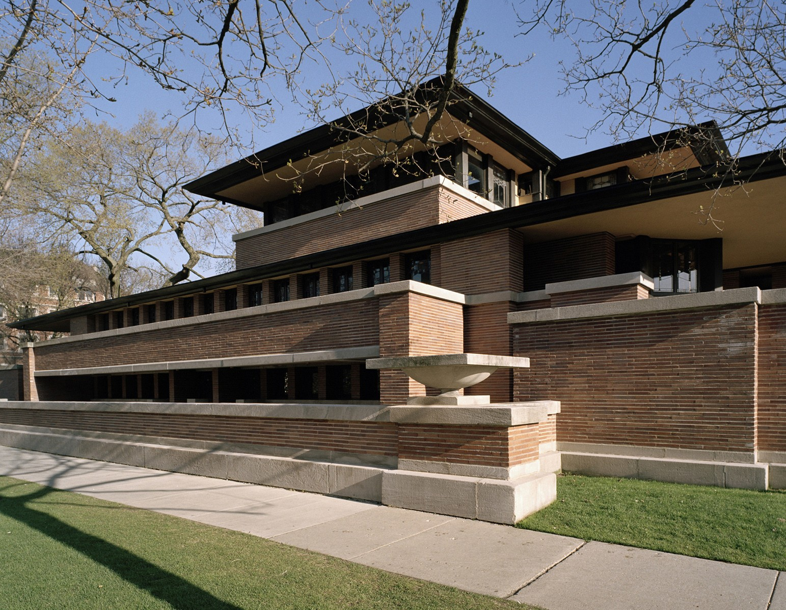
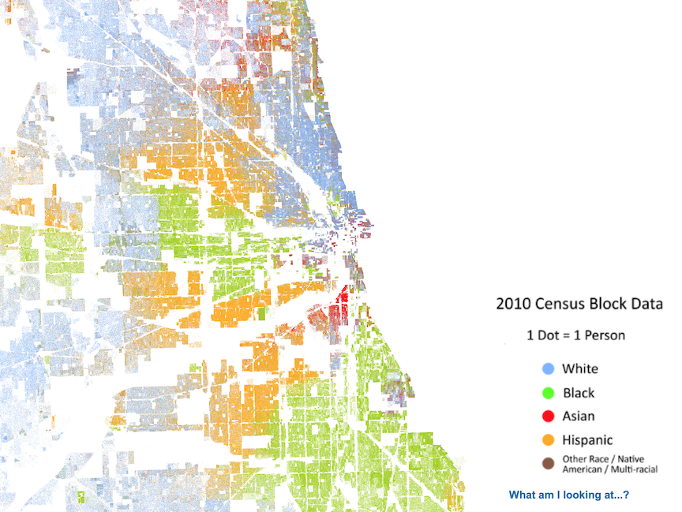
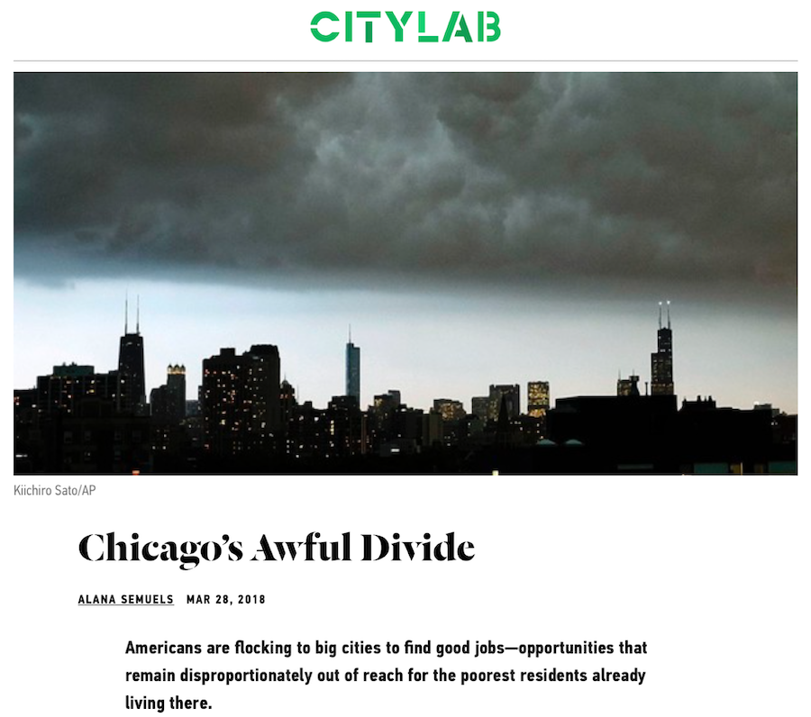
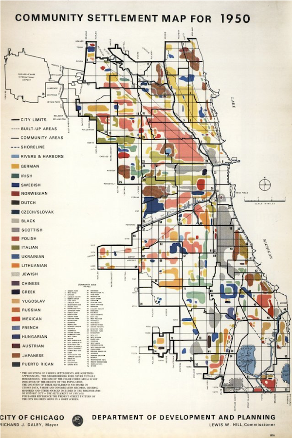
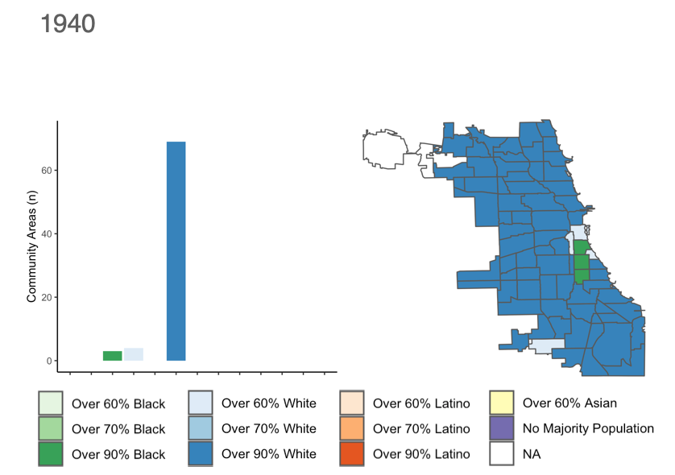

```{r setup, include=FALSE}
options(htmltools.dir.version = FALSE)
library(knitr)
#devtools::install_github("rstudio/fontawesome")
#devtools::install_github("gadenbuie/countdown")
library(fontawesome)
library(countdown)
knitr::opts_chunk$set(warning = FALSE, message = FALSE)

```
name: xaringan-title
class: left, top, inverse
background-image: url(images/02_1_anastasia-dulgier-OKOOGO578eo-unsplash.jpg)
background-size: cover

# Neighborhood Analysis
## Session 2: What is a Neighborhood?
---
name: Question 1
class: middle, inverse

# How has a neighborhood .salt[influenced] your life?

---
name: My turn to share
class: right, top
background-image: url(images/1_1_ross-elder-uXQVNkam3hE-unsplash.jpg)
background-size: cover


# My turn to share
---
name: My turn to share
class: right, top, inverse
background-image: url(images/02_6_neal-kharawala-XXA8PTuLD1Y-unsplash.jpg)
background-size: cover

# I Grew Up Here
---
name: My turn to share
class: left, top
background-image: url(images/02_7_map-chicago-panoramic-view-centered-on-hyde-park-projection-called-this-is-our-neighborhood-lauren-nassef.jpg)
background-size: auto

# More Specifically Here
## Hyde Park - Kenwood
---
name: My turn to share
class: left, top

# Hyde Park - Kenwood

.pull-left[

]
---
name: My turn to share
class: left, top

# Hyde Park - Kenwood

.pull-left[

]
.pull-right[

]
---
name: My turn to share
class: left, top

# Hyde Park - Kenwood

.pull-left[

]
.pull-right[

]
---
name: My turn to share
class: left, top

# Hyde Park - Kenwood

.pull-left[

]
.pull-right[

]
---
name: My turn to share
class: left, top

# Hyde Park - Kenwood

.pull-left[

]
.pull-right[

]
---
name: My turn to share
class: left, top

# Hyde Park - Kenwood

.pull-left[

]
.pull-right[

]
---
name: My turn to share
class: left, top

# This is Chicago

.pull-left[

]
.pull-right[

]
---
name: My turn to share
class: left, top

# This is Chicago

.pull-left[

]
.pull-right[

]
---
name: My turn to share
class: left, top

# This is Chicago

.pull-left[

]
.pull-right[

]
---
name: My turn to share
class: left, top

# This is Chicago

.pull-left[

]
.pull-right[

]
---
name: My turn to share
class: left, top

# This is Chicago

.pull-left[

]
.pull-right[

]
---
name: My turn to share
class: left, top

# This is Chicago

.pull-left[

]
.pull-right[

]
---
name: My turn to share
class: left, top, inverse
background-image: url(images/02_20_Network.png)
background-size:contain
---
name: My turn to share
class: left, top, inverse
background-image: url(images/02_21_Network_CL.png)
background-size:contain
---
name: My turn to share
class: left, top
background-image: url(images/02_22_Distriibution.png)
background-size:contain
---
name: Your Turn
class: left, middle, inverse
background-image: url(images/02_4_osh-nuttall-xl2piFfdzyA-unsplash.jpg)
background-size: cover

# Now its your turn <br>to share...
---
name: Your Turn
class: left, middle, inverse
background-image: url(images/02_4_osh-nuttall-xl2piFfdzyA-unsplash.jpg)
background-size: cover

# Who are you?
# Where is home? 
# What do you do here?
# What do you hope to <br>gain from our class?
---
name: Question 3 - Good Bad
class: top, right
background-image: url(images/02_5_pawel-czerwinski-T1ZIQDUjwiY-unsplash.jpg)
background-size: cover

# What makes a neighborhood <br>.salt[good] or .heat[bad]?
---
name: Question 4 - Gentrification
class: top, inverse
background-image: url(images/02_2_fernando-hernandez-zQzaErgqAmY-unsplash.jpg)
background-size: cover

# .fat[Gentrification] <br> What is it?
---
name: Question 2 - How should we measure Gentrification?
class: top, left, inverse
background-image: url(images/02_3_brandi-ibrao-fbRyfjb5N2Y-unsplash.jpg)
background-size: cover
# How should we measure it?

---

name: Next Class
class: top, left, inverse
background-image: url(images/03_23_david-werbrouck-5GwLlb-_UYk-unsplash.jpg)
background-size: cover

# Tuesday's Class
On Tuesday, we'll start exploring the R programming <br>language and RStudio Integrated Development Environment
