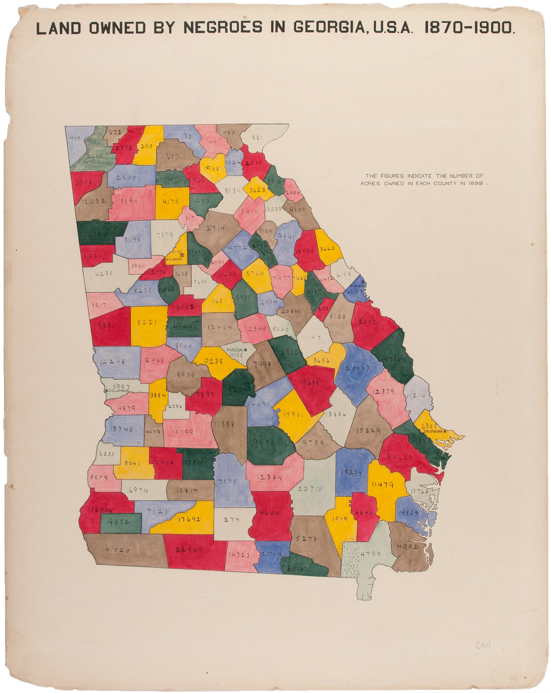
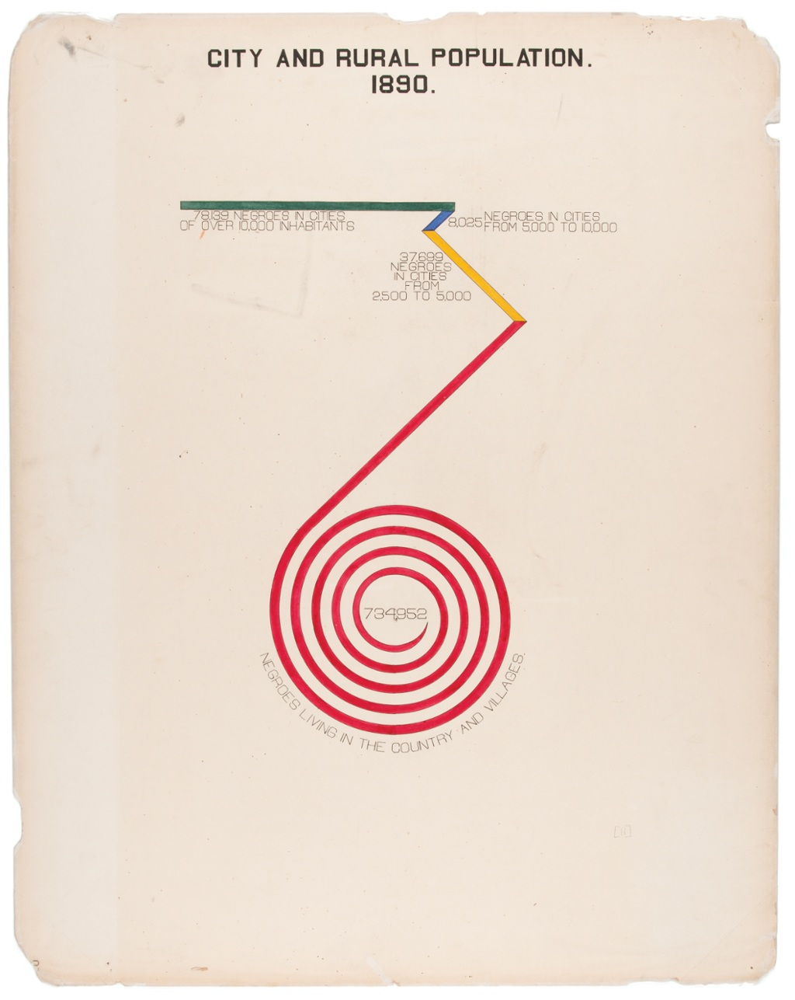
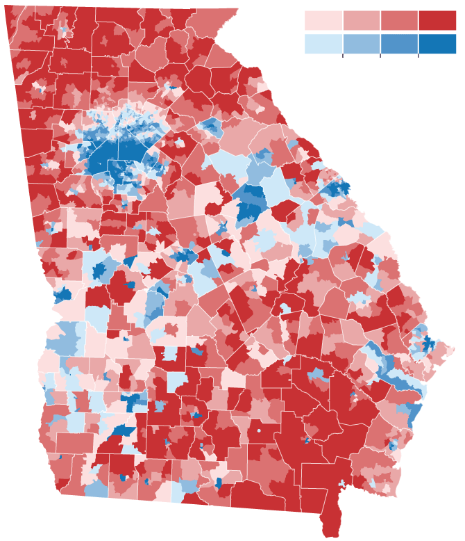

```{r setup, include=FALSE}
options(htmltools.dir.version = FALSE)
library(pacman)
p_load(knitr, fontawesome, countdown, xaringanExtra)
knitr::opts_chunk$set(warning = FALSE, message = FALSE)
xaringanExtra::use_panelset()
xaringanExtra::use_share_again()
xaringanExtra::style_share_again(
  share_buttons = c("twitter", "linkedin", "pocket")
)
```
name: Visualizing Data
class: right, top, inverse
background-image: url(images/01_VisualizingData.jpg)
background-size: cover

# Neighborhood Analysis
.font-35[Session 5: Visualizing Data]

???

---
name: Why Visualization?
class: right, middle

# Why do we visualize our data?
---
name: DuBois
class: left, top
background-image: url(images/02_DuBois_1.png)
background-size: contain
---
class: left, middle

.pull-left[

]

.pull-right[
“I got a couple of my best students and put a series of facts into charts: the size and growth of the Negro American group; its division by age and sex; its distribution, education and occupations; its books and periodicals. We made a most interesting set of drawings, limned on pasteboard cards about a yard square and mounted on a number of moveable standards. The details of finishing these 50 or more charts, in colors, with accuracy, was terribly difficult with little money, limited time and not much encouragement.”
]
---
class: left, middle

.pull-left[

]

.pull-right[

]
---
name: Lessons from DuBois
class: left, middle

# What power do DuBois' visualizations have today?
---
class: left, middle

## Does the abundance of data and visualization dilute their power?
---
class: left, middle

.pull-left[

]

.pull-right[
### How do craft visualizations that tell a story?
]
---
class: left, middle

.pull-left[.font-35[
<br>

<br><br>
In this week's labs you'll start to learn the *grammar of graphics* in GGplot]
]
---
class: left, middle

.pull-left[.font-35[
<br>

<br><br>
In this week's labs you'll start to learn the *grammar of graphics* in GGplot]
]

.pull-right[

<br>
<span style='color: #FDC87A;'>Data:</span> Your source data

<span style='color: #50A781;'>Aesthetics:</span> What variables are visualized and how

<span style='color: #568DC1;'>Geometry:</span> The specific plot type we would like to make

<span style='color: #946EB2;'>Facets:</span> Facets allow us to (optionally) split our plot into a multiple subsets

<span style='color: #D6656A;'>Statistics:</span> summaries or indicators of the distribution of our data

<span style='color: #C3A385;'>Coordinates:</span> Coordinate system for the plot

<span style='color: #FDC87A;'>Themes:</span> Collections of plot styles and options
]
---
class: left, top

#   Basic template

- ggplot: "Initialize" a map object (data frame, aesthetics, columns...)
- geom: add layers (use the ** + ** operator)
- The **+** sign used to add new layers must be placed at the end of the line


```{r eval=FALSE}
ggplot(data = <DATA>, mapping = aes(<MAPPINGS>)) +  <GEOM_FUNCTION>()

```
---
# Aesthetics

Item | Description
---------| -------------
x	| Position on x-axis
y	| Position on y-axis
shape	| Shape
color |	Color of border of elements
fill | 	Color of inside of elements (changes the color of the graph by group/facor)
size |	Size
alpha | 	Transparency (1: opaque; 0: transparent)
line type  |	Type of line (e.g., solid, dashed)

---
class: left, top

# Geometries

Item | Description
---------| -------------
geom_point | Scatter plots, dot plots, etc.     
geom_boxplot | Boxplots    
geom_line | Trend lines, time series, etc.   
geom_path |Connects the observations in the order in which they appear in the data
geom_histogram | Visualise the distribution of a single continuous variable 
geom_hline  | Add horizontal reference lines
geom_vline  | Add vertical reference lines
geom_smooth  | Add a smoothing line in order to see what the trends look like
geom_sf| Visualize simple feature (sf) objects(maps)

---
class: middle

.font-35[With <span style='color: #FDC87A;'>Data</span> , 
<span style='color: #50A781;'>Aesthetics</span>, and 
<span style='color: #568DC1;'>Geometry</span>, you can make a plot - in this lab you'll learn how to start layering plot elements together and refining plots iteratively.]
---
name: Next Class
class: top, left

# Thursday's Class
.font-35[On Thursday, we'll continue working on our manipulation of basic data visualizations]
---