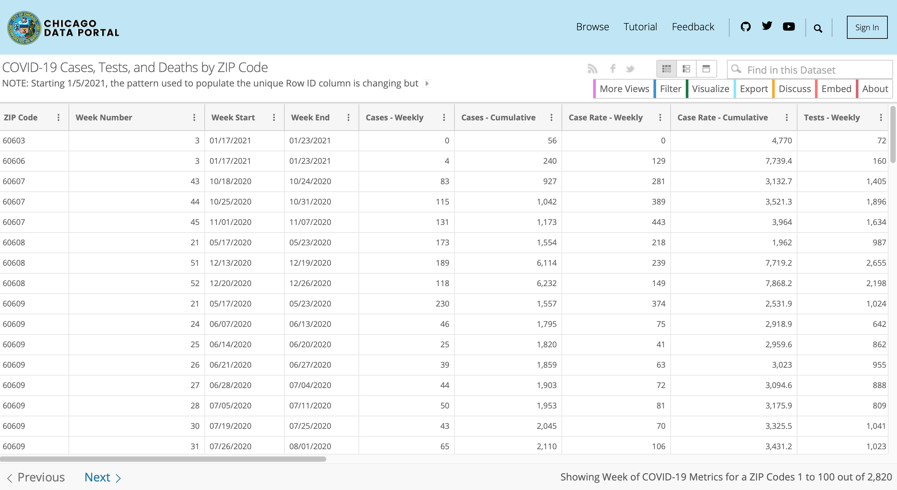

```{r setup, include=FALSE}
options(htmltools.dir.version = FALSE)
library(pacman)
p_load(knitr, fontawesome, countdown, xaringanExtra)
knitr::opts_chunk$set(warning = FALSE, message = FALSE)
xaringanExtra::use_panelset()
xaringanExtra::use_share_again()
xaringanExtra::style_share_again(
  share_buttons = c("twitter", "linkedin", "pocket")
)
```
name: Visualizing Data
class: right, top, inverse
background-image: url(images/01_VisualizingData.jpg)
background-size: cover

# Neighborhood Analysis
.font-35[Session 5: Visualizing Data]

???

---
name: Why Visualization?
class: right, middle

# Why do we visualize our data?
---
name: DuBois
class: left, top
background-image: url(images/02_DuBois_1.png)
background-size: contain
---
class: left, middle

.pull-left[

]

.pull-right[
“I got a couple of my best students and put a series of facts into charts: the size and growth of the Negro American group; its division by age and sex; its distribution, education and occupations; its books and periodicals. We made a most interesting set of drawings, limned on pasteboard cards about a yard square and mounted on a number of moveable standards. The details of finishing these 50 or more charts, in colors, with accuracy, was terribly difficult with little money, limited time and not much encouragement.”
]
---
class: left, middle

.pull-left[

]

.pull-right[

]
---
class: left, middle

.pull-left[

]

.pull-right[
### How do craft visualizations that tell a story today?
]
---
class: left, middle

.pull-left[.font-35[
<br>

<br><br>
In this week's labs you'll start to learn the *grammar of graphics* in GGplot]
]
---
class: left, middle

.pull-left[.font-35[
<br>

<br><br>
In this week's labs you'll start to learn the *grammar of graphics* in GGplot]
]

.pull-right[

<br>
<span style='color: #FDC87A;'>Data:</span> Your source data

<span style='color: #50A781;'>Aesthetics:</span> What variables are visualized and how

<span style='color: #568DC1;'>Geometry:</span> The specific plot type we would like to make

<span style='color: #946EB2;'>Facets:</span> Facets allow us to create small multiples

<span style='color: #D6656A;'>Statistics:</span> summaries of data distribution

<span style='color: #C3A385;'>Coordinates:</span> Coordinate system for the plot

<span style='color: #FDC87A;'>Themes:</span> Collections of plot styles and options
]
---
class: left, top

#   Basic template

- ggplot: "Initialize" a map object (data frame, aesthetics, columns...)
- geom: add layers (use the ** + ** operator)
- The **+** sign used to add new layers must be placed at the end of the line


```{r eval=FALSE}
ggplot(data = <DATA>, mapping = aes(<MAPPINGS>)) +  <GEOM_FUNCTION>()

```
---
# Aesthetics
```{r eval=FALSE}
ggplpt(data = <DATA>, mapping = aes(<mappings)) + <GEOM_FUNCTION>()
```

Item | Description
---------| -------------
x	| Position on x-axis
y	| Position on y-axis
shape	| Shape
color |	Color of border of elements
fill | 	Color of inside of elements (changes the color of the graph by group/facor)
size |	Size
alpha | 	Transparency (1: opaque; 0: transparent)
line type  |	Type of line (e.g., solid, dashed)

---
class: left, top

# Geometries
```{r eval=FALSE}
ggplpt(data = <DATA>, mapping = aes(<mappings)) + <GEOM_FUNCTION>()
```
Item | Description
---------| -------------
geom_point | Scatter plots, dot plots, etc.     
geom_boxplot | Boxplots    
geom_line | Trend lines, time series, etc.   
geom_path |Connects the observations in the order in which they appear in the data
geom_histogram | Visualise the distribution of a single continuous variable 
geom_hline  | Add horizontal reference lines
geom_vline  | Add vertical reference lines
geom_smooth  | Add a smoothing line in order to see what the trends look like
geom_sf| Visualize simple feature (sf) objects(maps)

---
name: pause for covid
class: top, left

# A Tweet sparks a question...
.pull-left[
```{r CDPH_Tweet, echo=FALSE, out.width="83%"}

```
]

.pull-right[
.font-35[
Sorry to bring COVID into this...

What demographic factors help to explain the difference between where people are dying and where vaccinations are occurring?
]
]
---
name: Get Data
class: top, left

```{r chi_portal, echo=FALSE, out.width="100%"}
include_graphics("images/chi_portal_covid.png")
```
---
name: Get Data 2
class: top, left

```{r chi_portal2, echo=FALSE, out.width="100%"}

```
---
name: Get Data 3
class: top, left

```{r chi_portal3, echo=FALSE, out.width="100%"}

```
---
name: Scatterplot COVID Infection Rate
class: top, left
```{r work_stuff, echo=FALSE}
pacman::p_load("ggplot2", "RSocrata", "sf", "tidyverse", "tigris")

if (file.exists("data/chi_ph.rds")){dataset<-readRDS("data/chi_ph.rds")}
if (!file.exists("data/chi_ph.rds")){
  cdph<-RSocrata::read.socrata("https://data.cityofchicago.org/resource/yhhz-zm2v.json")
cdph_vacc<-RSocrata::read.socrata("https://data.cityofchicago.org/resource/553k-3xzc.json")

cdph_chart<-cdph %>% 
  filter(week_number == 3) %>% 
  select(zip_code, percent_tested_positive_cumulative, death_rate_cumulative) %>% mutate(percent_tested_positive_cumulative = as.numeric(percent_tested_positive_cumulative), death_rate_cumulative = as.numeric(death_rate_cumulative))

vacc_chart<-cdph_vacc %>% 
  filter(date == "2021-01-25") %>% 
  select(zip_code, X_1st_dose_percent_population) %>% mutate(X_1st_dose_percent_population = as.numeric(X_1st_dose_percent_population))
dataset<-left_join(cdph_chart, vacc_chart, by="zip_code")

dir.create("data")
saveRDS(dataset, "data/chi_ph.rds")
rm(cdph, cdph_vacc)
}

```

.font-35[What's the relationship between COVID *cases* and vaccinations?]
.pull-left[

.panelset[
   .panel[.panel-name[Output]

```{r scatterplot, echo=FALSE}
ggplot(dataset %>% filter(percent_tested_positive_cumulative !=0)) +
  geom_point(aes(x=percent_tested_positive_cumulative, y=X_1st_dose_percent_population))+
  labs(x="Pop. Positive (%)", y="Pop. Vaccinated (%)")+
  scale_x_continuous(labels=scales::percent)+
  scale_y_continuous(labels=scales::percent)+
  theme_minimal()
```
   ]
   .panel[.panel-name[Code]
```{r scatterplot_code, eval=FALSE}
ggplot(dataset %>% filter(percent_tested_positive_cumulative !=0)) +
  geom_point(aes(x=percent_tested_positive_cumulative, y=X_1st_dose_percent_population))+
  labs(x="Pop. Positive (%)", y="Pop. Vaccinated (%)")+
  scale_x_continuous(labels=scales::percent)+
  scale_y_continuous(labels=scales::percent)+
  theme_minimal()
```
   ]
]
]
.pull-right[
How would you describe this in your own words?

- What does each point represent?

- Are the scales for X and Y reasonable? What do they tell you?

- Is there a particular region on this plot that might spark questions for further exploration?

- Are you ready to write an op-ed for the Chicago Tribune or Sun Times (the two major newspapers)?
]
---
name: Scatterplot death rate
class: top, left

.font-35[What's the relationship between COVID *deaths* and vaccinations?]
.pull-left[
.panelset[
.panel[.panel-name[Output]
```{r scatterplot_death, echo=FALSE}
ggplot(dataset %>% filter(death_rate_cumulative !=0)) +
  geom_point(aes(x=death_rate_cumulative, y=X_1st_dose_percent_population))+
  labs(x="Death Rate (per 1,000)", y="Pop. Vaccinated (%)")+
  scale_x_continuous(labels=scales::percent)+
  scale_y_continuous(labels=scales::percent)+
  theme_minimal()
```
]

.panel[.panel-name[Code]
```{r scatterplot_death_output, eval=FALSE}
ggplot(dataset %>% filter(percent_tested_positive_cumulative !=0)) +
  geom_point(aes(x=death_rate_cumulative, y=X_1st_dose_percent_population))+
  labs(x="Death Rate (per 1,000)", y="Pop. Vaccinated (%)")+
  scale_x_continuous(labels=scales::percent)+
  scale_y_continuous(labels=scales::percent)+
  theme_minimal()
```
]

]
]
.pull-right[
How would you describe this in your own words?

- What does each point represent?

- Are the scales for X and Y reasonable? What do they tell you?

- Is there a particular region on this plot that might spark questions for further exploration?

- Are you ready to write an op-ed for the Chicago Tribune or Sun Times (the two major newspapers)?
]
---
name: Maps
class: top, left

```{r map_it, echo=FALSE}
if(file.exists("data/zips.rds")){
  zips<-readRDS("data/zips.rds")
  zips<-st_as_sf(zips)
}

if(!file.exists("data/zips.rds")){
  zips<-tigris::zctas(state="IL", class="sf") %>% 
    filter(substr(GEOID10, 0, 3) %in% c("606", "608"))
  saveRDS(zips, "data/zips.rds")
}

if(file.exists("data/chi.rds")){
  chi<-readRDS("data/chi.rds")
  chi<-st_as_sf(zips)
}

if(!file.exists("data/chi.rds")){
chi<-tigris::places(state="IL", class="sf") %>% filter(NAME == "Chicago")
saveRDS(chi, "data/chi.rds")
}

dataset<-left_join(dataset, zips, by=c("zip_code" = "GEOID10")) %>% st_as_sf()
```
.pull-left[
.panelset[
.panel[.panel-name[Output]
```{r map_tested, echo=FALSE}
ggplot() +
  geom_sf(data=dataset, aes(fill=percent_tested_positive_cumulative))+
  scale_fill_continuous(trans = 'reverse')+
  geom_sf(data=chi, colour="gray40", fill=NA)+
  labs(fill="Pop. Positive (%)")+
  theme_minimal()
```
]
.panel[.panel-name[Code]
```{r map_tested_code, eval=FALSE}
ggplot() +
  geom_sf(data=dataset, aes(fill=percent_tested_positive_cumulative))+
  scale_fill_continuous(trans = 'reverse')+
  geom_sf(data=chi, colour="gray40", fill=NA)+
  labs(fill="Pop. Positive (%)")+
  theme_minimal()
```
]
]]

.pull-right[
.panelset[
.panel[.panel-name[Output]
```{r map_vaccinated, echo=FALSE}
ggplot() +
  geom_sf(data=dataset, aes(fill=X_1st_dose_percent_population))+
  scale_fill_continuous(trans = 'reverse')+
  geom_sf(data=chi, colour="gray40", fill=NA)+
  labs(fill="Pop. Vaccinated (%)")+
  theme_minimal()
```
]
.panel[.panel-name[Code]
```{r map_vaccinated_code, eval=FALSE}
ggplot() +
  geom_sf(data=dataset, aes(fill=X_1st_dose_percent_population))+
  scale_fill_continuous(trans = 'reverse')+
  geom_sf(data=chi, colour="gray40", fill=NA)+
  labs(fill="Pop. Vaccinated (%)")+
  theme_minimal()
```
]
]

]

---
name: Maps2
class: top, left

.pull-left[
.panelset[
.panel[.panel-name[Output]
```{r map_died, echo=FALSE}
ggplot() +
  geom_sf(data=dataset, aes(fill=death_rate_cumulative))+
  scale_fill_continuous(trans = 'reverse')+
  geom_sf(data=chi, colour="gray40", fill=NA)+
  labs(fill="Pop. Died (%)")+
  theme_minimal()
```
]
.panel[.panel-name[Code]
```{r map_died_code, eval=FALSE}
ggplot() +
  geom_sf(data=dataset, aes(fill=death_rate_cumulative))+
  scale_fill_continuous(trans = 'reverse')+
  geom_sf(data=chi, colour="gray40", fill=NA)+
  labs(fill="Pop. Died (%)")+
  theme_minimal()
```
]
]]

.pull-right[
.panelset[
.panel[.panel-name[Output]
```{r map_vaccinated2, echo=FALSE}
ggplot() +
  geom_sf(data=dataset, aes(fill=X_1st_dose_percent_population))+
  scale_fill_continuous(trans = 'reverse')+
  geom_sf(data=chi, colour="gray40", fill=NA)+
  labs(fill="Pop. Vaccinated (%)")+
  theme_minimal()
```
]
.panel[.panel-name[Code]
```{r map_vaccinated_code2, eval=FALSE}
ggplot() +
  geom_sf(data=dataset, aes(fill=X_1st_dose_percent_population))+
  scale_fill_continuous(trans = 'reverse')+
  geom_sf(data=chi, colour="gray40", fill=NA)+
  labs(fill="Pop. Vaccinated (%)")+
  theme_minimal()
```
]
]

]
---
name: What Next?
class: bottom, left
background-image: url(images/kelly-sikkema-cXkrqY2wFyc-unsplash.jpg)
background-size: cover

### .salt[What Next?]
.font-35[
What are the types of things you would want to <br>explore to understand what's going on here?

Where might the information come from?
]
---
class: middle

.font-35[With <span style='color: #FDC87A;'>Data</span> , 
<span style='color: #50A781;'>Aesthetics</span>, and 
<span style='color: #568DC1;'>Geometry</span>, you can make a plot - in this week's lab you'll learn how to start layering plot elements together and take an iterative approach to refining plots.]
---
name: Next Class
class: top, left

# Thursday's Class
.font-35[On Thursday, we'll continue working on our manipulation of basic data visualizations]