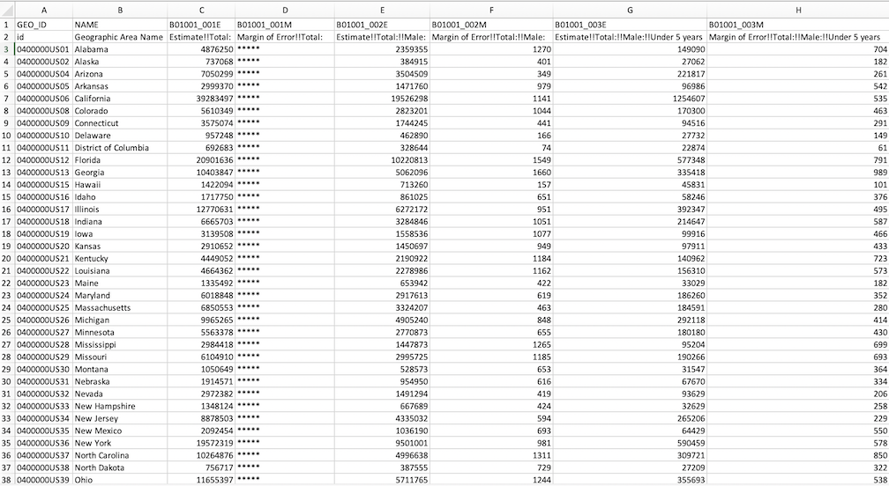

```{r setup, include=FALSE}
options(htmltools.dir.version = FALSE)
library(pacman)
p_load(knitr, fontawesome, countdown, xaringanExtra)
knitr::opts_chunk$set(warning = FALSE, message = FALSE)
xaringanExtra::use_panelset()
xaringanExtra::use_share_again()
xaringanExtra::style_share_again(
  share_buttons = c("twitter", "linkedin", "pocket")
)
```
name: Population Demographics
class: right, bottom
background-image: url(images/01_timon-studler-ABGaVhJxwDQ-unsplash.jpg)
background-size: cover

# Neighborhood Analysis
.font-35[Session 9: Population]

???
---
name: What's a Population?
class: left, bottom, inverse
background-image: url(images/01a_population.jpeg)
background-size: cover

# What's a population?
--
.font-35[The total number of people living in a location at a particular point in time]
---
name: What's a Population?
class: left, middle

.pull-left[


.fat[Administrative]

]
--
.pull-right[

.font-35[
- This is Champaign County, Illinois. It has a 2019 population of 209,689

- What are some other examples of administrative geographies?
]]
---
name: What's a Population?
class: left, middle

.pull-left[


.salt[Institutional]

]
--
.pull-right[

.font-35[

- This is Stateville Correctional Center in Crest Hill Illinois. It has a capacity of 4,134 and a population of 2,256.

- What are some other examples of institutional geographies?
]]
---
name: What's a Population?
class: left, middle

.pull-left[


.font-35[Political]

]
--
.pull-right[

.font-35[

- This is The European Union. It has a population of 447.7 million people.

- What are some other examples of political geographies?
]]
---
name: Population Characteristics and Structure
class: top, left

.pull-left[
## Population Structure

.font-35[
- Population Size
- Population Density
- Age Structure
- Gender
- Fertility
- Mortality
- Age Dependency Ratio
]
]
---
## Population Pyramids

.pull-left[
- Age by *Cohort*
- Gender
]

.pull-right[

]
---
## Population Pyramids

.pull-left[
- Age by *Cohort*
- Gender
]

.pull-right[

]

---
## Population Pyramids

.pull-left[
- Age by *Cohort*
- Gender
]

.pull-right[

]
---
background-image: url(images/08_world-pyramid.jpg)
background-size: contain
---
background-image: url(images/09_longitudinal.png)
background-size: contain
---
background-image: url(images/10_comparison.gif)
background-size: contain
---
class: middle
## Champaign Co. and Cook Co. Age Structure
.pull-left[

]
.pull-right[

]
---
## Other Elements

.pull-left[

**Composition**
- Age structure
- Gender
- Age Dependence Ratio
- Population Density

**Income**
- Per Capita Income
- Median Household Income
- Median Family Income
- Poverty Rate

**Identity**
- Race
- Ethnicity
- Foreign-Born Population
]

.pull-right[
**Housing**
- Median Gross Rent
- Median Home Value
- Housing Costs as Percent of Income
- Housing Cost Burden (30% income)

**Jobs**
- Unemployment rate
- Work by sector

**Transportation**
- Commute time
- Commute mode
- Households without Cars
]
---
# Working With Census Data

.pull-left[
```{r echo=FALSE}

```
]

.pull-right[Planners work with Census data frequently, but it can be time consuming to download and manipulate.

[data.census.gov](data.census.gov) is the primary access point for Census data

The Census Bureau maintains an API (Application Programming Interface) from which we can request raw data from the Census servers

The `tidycensus` package is designed to make the requests on our behalf and to format the results.]

---
# Common Census Geographies

.pull-left[
```{r echo=FALSE}
knitr::include_graphics("images/WB_3_Geogs.png")
```
]

.pull-right[
States, Counties, Places, and Tracts are the most common reference geographies for planners

States, counties, and tracts are hierarchical - states contain counties, and counties contain tracts.

Zip Code Tabulation Areas (ZCTAs) and Transportation Analysis Zones (TAZs) have more specialized applications

]

---
# Tables

.pull-left[
```{r echo=FALSE}

```
]

.pull-right[

```{r echo=FALSE}

```
]

---
# Tables

.pull-left[

```{r echo=FALSE}

```
]

.pull-right[

```{r echo=FALSE}

```
]

---
# How can tidycensus help?

.pull-left[
```{r message=FALSE}
library(tidycensus)
census_api_key("936c96236b979ae522c6cf67edb51923cd391fb3")

dataset<-get_acs(geography="state", table = "B01001", year=2019, survey="acs5", format="wide")
```
]

.pull-right[
```{r echo=FALSE}
knitr::kable(dataset)
```
]

name: Next Class
class: top, left
---
# Thursday's Class
.font-35[On Thursday, we'll continue working on our population lab]